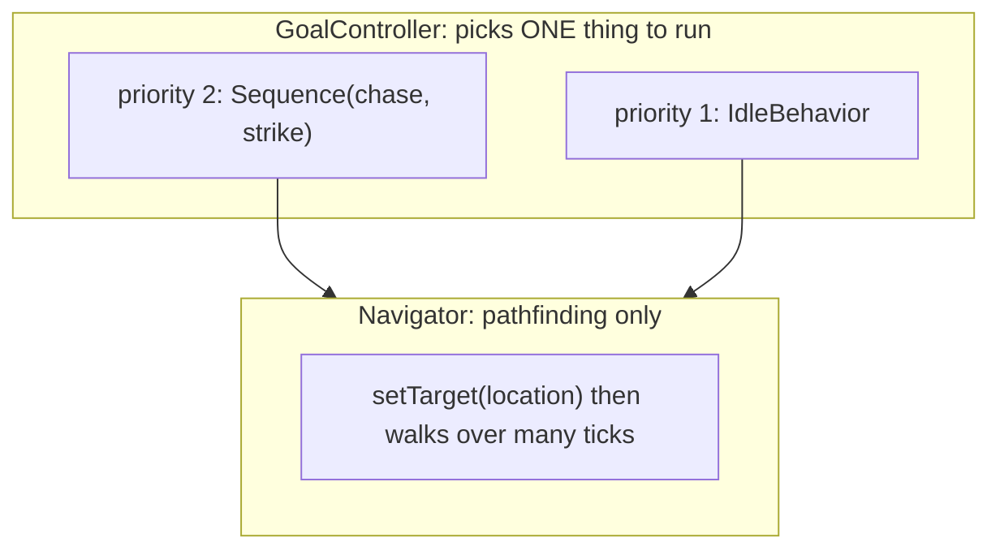
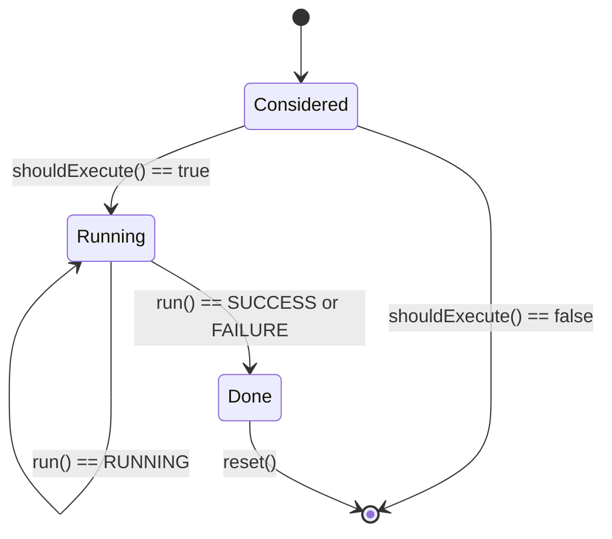
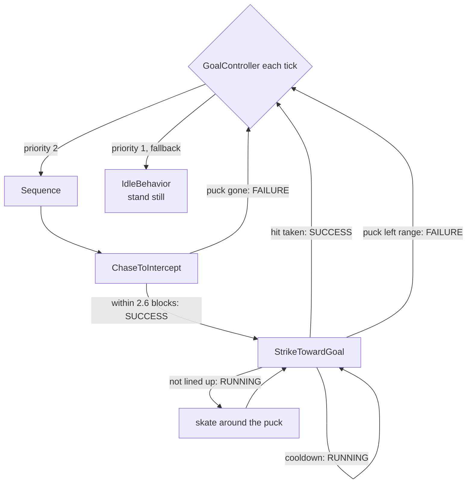
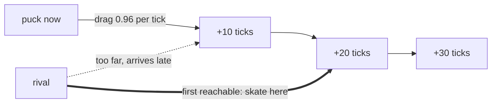
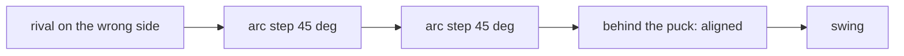

# Behavior trees in Citizens (as used by the Rival)

Study notes for this project. Everything here maps to real code in
[`src/main/java/com/github/denmeh/npcaitest`](../src/main/java/com/github/denmeh/npcaitest).

Citizens AI is **behavior trees** plus a **Navigator**. It is *not* GOAP: there is no planner, nothing
searches for a sequence of actions. The word "Goal" in Citizens means "a task the scheduler can pick",
not "Goal-Oriented Action Planning".

## 1. The two layers



- **`GoalController`** (`npc.getDefaultGoalController()`) runs every tick and picks the
  **highest-priority behavior whose `shouldExecute()` is true**. Only one runs at a time.
- **`Behavior`** is the tree node. Leaves extend `BehaviorGoalAdapter`; composites
  (`Sequence`, `Selector`, `IfElse`) combine them.
- **`Navigator`** only walks. It knows nothing about the tree. You set a target **once**
  and it paths there over many ticks.

## 2. Node lifecycle

Every node is a tiny state machine with three methods:

| Method | When Citizens calls it | What it is for |
|---|---|---|
| `shouldExecute()` | **once**, when the parent is choosing a child | "Can I run right now?" |
| `run()` | **every tick**, while the node returns `RUNNING` | do the work, report status |
| `reset()` | when the node stops running | clear state, cancel navigation |



The status returned by `run()` drives everything:

| Status | Meaning |
|---|---|
| `RUNNING` | Not finished; call me again next tick |
| `SUCCESS` | Finished well; the parent may advance |
| `FAILURE` | Failed; a `Sequence` aborts, a `Selector` can try another child |
| `RESET_AND_REMOVE` | Parent composite should drop this child entirely |

**The trap:** `shouldExecute()` runs *once*, not every tick. Anything that changes while the node runs
(the puck moving, a cooldown expiring) must be re-checked inside `run()`.

## 3. Composites

- **`Sequence.createSequence(a, b)`** — run `a`, then `b`. First `FAILURE` aborts the whole sequence.
- **`Selector.selecting(a, b).build()`** — pick **one** child (random by default; use
  `Selectors.prioritySelector` for ordered).
- **`IfElse.create(cond, ifNode, elseNode)`** — condition evaluated in `shouldExecute()`.
- Decorators wrap a single child: `TimerDecorator.tickLimiter`, `TimeoutDecorator`,
  `RetryDecorator`, `InverterDecorator`, `Precondition`, `Loop`, `Callback`.

### Sequence semantics, which bit us twice

`Sequence` is strict: a child returning `FAILURE` kills the run, and the tree restarts from the top
next tick. Two real bugs in this project came from that:

1. `StrikeTowardGoal` returned `FAILURE` while its attack cooldown was still ticking. The sequence
   aborted, `reset()` cancelled navigation, and the Rival stood next to the puck doing nothing.
   **Fix:** return `RUNNING` while waiting, not `FAILURE`.
2. `StrikeTowardGoal` returned `FAILURE` when the shooting angle was briefly wrong. It never got the
   chance to fix its position, so it circled forever without shooting.
   **Fix:** stay `RUNNING` and *steer* while lining up.

Rule of thumb: **`FAILURE` means "this is impossible now", not "I am not done yet".**

## 4. The Rival's tree



| Node | File | Job |
|---|---|---|
| `ChaseToIntercept` | [ChaseToIntercept.java](../src/main/java/com/github/denmeh/npcaitest/arena/ai/ChaseToIntercept.java) | Skate to the attack stance or the defensive block point |
| `StrikeTowardGoal` | [StrikeTowardGoal.java](../src/main/java/com/github/denmeh/npcaitest/arena/ai/StrikeTowardGoal.java) | Circle into position, then swing |
| `IdleBehavior` | [IdleBehavior.java](../src/main/java/com/github/denmeh/npcaitest/ai/IdleBehavior.java) | Fallback while the puck is respawning |
| `RivalContext` | [RivalContext.java](../src/main/java/com/github/denmeh/npcaitest/arena/ai/RivalContext.java) | Shared geometry, aiming, look control, shot plan |

`RivalContext` is deliberately **not** a node. Leaves stay small and readable; all the hockey maths
(where to stand, where to aim, how to turn the head) lives in one place both leaves can query.

### Attack vs defend

Decided **inside `run()`**, every tick, so it can flip mid-skate:

- Puck closer to the **red / rival** net → skate **between the puck and that net** (defend).
- Otherwise → skate **behind the puck** relative to the blue player net (attack).

Both are judged on the *predicted* puck position, not the current one, so the Rival commits to
defending before the puck actually arrives.

### Puck prediction (leading the puck)

Skating to where the puck **is** means always arriving late: by the time the Rival gets there, the
puck has slid on. `interceptPuckLocation()` solves for where to meet it instead.

The puck is simulated forward with per-tick drag, then the first reachable point wins:

```java
for (int ticks = 0; ticks <= 30; ticks += 2) {
    best = puckAfter(ticks);                                  // simulate the slide
    if (distanceTo(best) / RIVAL_TICK_SPEED <= ticks) {        // can we be there in time?
        break;
    }
}
```



Details that matter:

- **Drag**: a turtle sliding on ice keeps ~96% of its speed per tick, so the path curves to a stop
  rather than running forever.
- **Boards**: the simulated position is clamped inside the rink, so predictions never point through a wall.
- **Slow puck**: below 0.08 blocks/tick the prediction is skipped and the current position is used,
  otherwise the target would jitter while the puck sits still.
- **Horizon**: capped at 30 ticks (1.5 s) so he never commits to an absurd far-future spot.

`RIVAL_TICK_SPEED` (0.3 blocks/tick) is the tuning knob: raise it and he leads the puck further,
believing he is faster than he is.

### The skate-around ("giro")

The Rival must be *behind* the puck to shoot it forward. Steering straight to that spot walks through
the puck, which is a solid turtle. So `orbitPoint()` returns **one 45-degree arc step** around the
puck at a 2.2 block radius, recomputed each tick. Repeated ticks trace a circle.



Guards against getting stuck:

- Puck pinned to the boards where getting behind it is impossible: after ~45 ticks, **shoot anyway**.
- Puck buried in a corner: aim at **center ice** instead of the net, which clears it into open play.

## 5. Navigator vs direct movement

Two different movement tools, used for different jobs:

| Tool | Use | Rule |
|---|---|---|
| `navigator.setTarget(loc)` | Long skate across the rink; real pathfinding | Set it **once per destination**, never every tick |
| `npc.setMoveDestination(loc)` | Short, precise steering (orbit, closing in) | Straight line, **must** be called every tick |

`ChaseToIntercept` switches between them by distance: beyond 5 blocks it pathfinds (and only re-paths
when the target moved more than 0.6 blocks, at most every 4 ticks, because a predicted target moves
constantly); inside 5 blocks it cancels navigation and steers in a straight line, which tracks a
moving puck far better. `StrikeTowardGoal` always steers directly for the tight circling.

Useful `NavigatorParameters` (see [RivalNpc.java](../src/main/java/com/github/denmeh/npcaitest/arena/RivalNpc.java)):

| Parameter | Why it matters here |
|---|---|
| `speedModifier(1.75)` | Citizens has no "sprint"; speed is how you fake it |
| `distanceMargin(0.75)` | Default is **2 blocks**, so the NPC stopped short and could never reach melee range |
| `lookAtFunction(...)` | Overrides where the NPC looks while pathing |

### Look control

Two systems both wanted to turn the head (`lookAtFunction` and our own `faceLocation`), which caused
the jittery, sky-staring pivot. Now `RivalContext.lookTarget()` is the single source of truth:
both call it, the yaw turns at a capped rate per tick, and the target is kept **level with the feet**
so pitch never cranes up or down.

## 6. Adding a new leaf

```java
public final class MyLeaf extends BehaviorGoalAdapter {

    private final RivalContext ctx;

    @Override
    public boolean shouldExecute() {
        return ctx.spawned() && ctx.puckAlive();   // cheap check, called once
    }

    @Override
    public BehaviorStatus run() {
        if (impossibleNow()) {
            return BehaviorStatus.FAILURE;         // genuinely cannot continue
        }
        if (stillWorking()) {
            return BehaviorStatus.RUNNING;         // includes "waiting for a cooldown"
        }
        return BehaviorStatus.SUCCESS;
    }

    @Override
    public void reset() {
        // clear per-run state; cancel navigation if this leaf started it
    }
}
```

Register it as part of the tree, not as another loose priority:

```java
controller.addBehavior(Sequence.createSequence(new ChaseToIntercept(ctx), new MyLeaf(ctx)), 2);
controller.addBehavior(new IdleBehavior(rival), 1);
```

## 7. Debugging

`TestNpc.setActiveNode(...)` records which node is live; `/npctest status` and the action bar show it.

| Label | Meaning |
|---|---|
| `CHASE_ATTACK` | Skating behind a settled puck to shoot it |
| `CHASE_LEAD` | Puck is sliding; skating to the predicted intercept |
| `CHASE_DEFEND` | Getting between a settled puck and the red net |
| `DEFEND_LEAD` | Cutting off a puck sliding toward the red net |
| `SKATE_AROUND` | In range but wrong side; circling the puck |
| `STRIKE` | Lined up; swinging or waiting out the swing cooldown |
| `IDLE` | Fallback, usually while the puck respawns |

When behaviour looks wrong, read that label first: it tells you whether the tree picked the wrong node
or the right node is doing the wrong thing.

## 8. Sources

- [Citizens API wiki](https://wiki.citizensnpcs.co/API)
- [`net.citizensnpcs.api.ai.tree` javadocs](https://jd.citizensnpcs.co/net/citizensnpcs/api/ai/tree/package-summary.html)
- [`NavigatorParameters` javadocs](https://jd.citizensnpcs.co/net/citizensnpcs/api/ai/NavigatorParameters.html)
