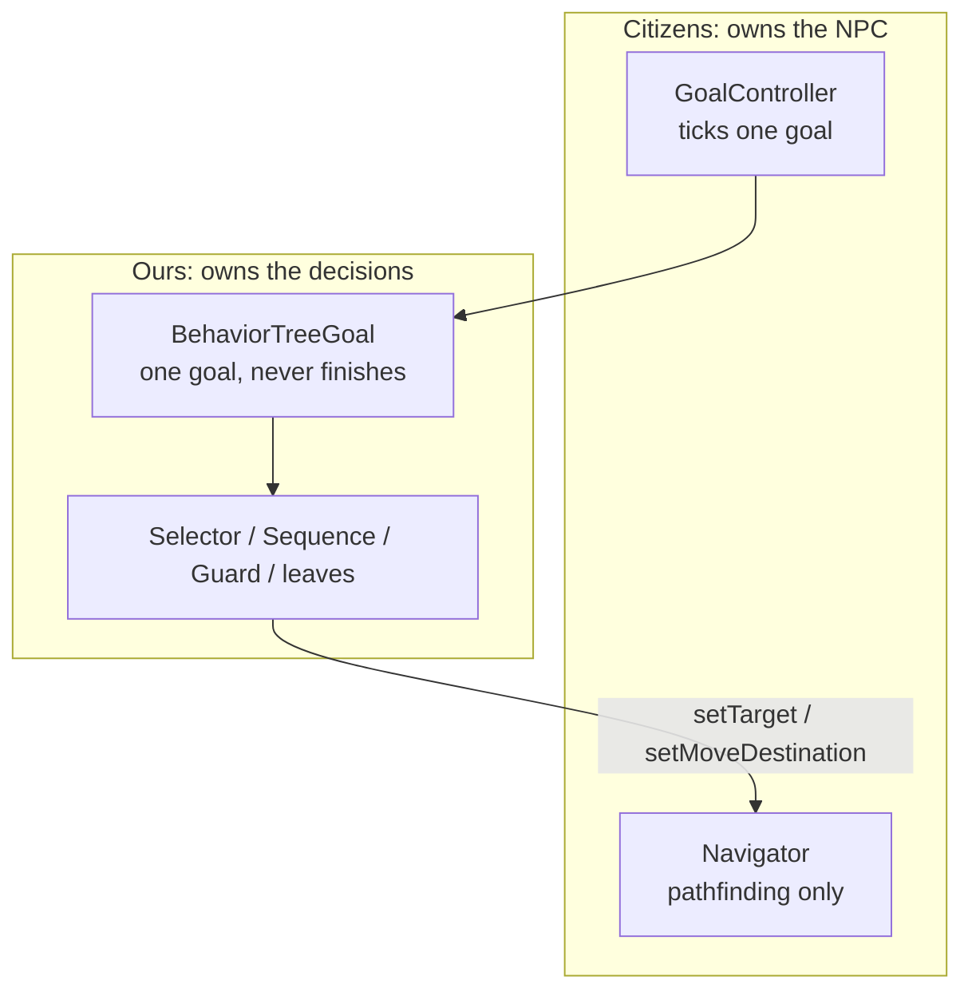
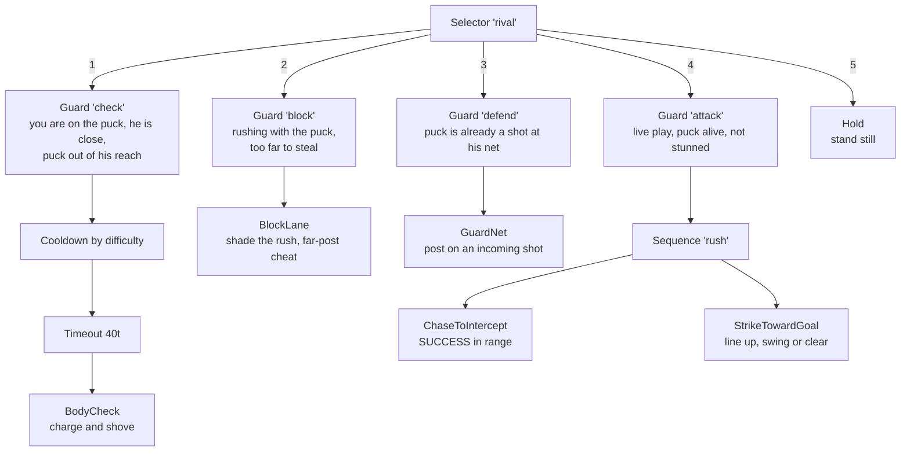
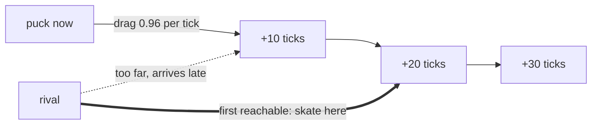
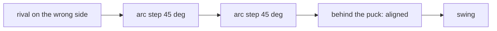

# Behavior trees (as used by the Rival)

Study notes for this project. Everything here maps to real code in
[`src/main/java/com/github/denmeh/rinkrival`](../src/main/java/com/github/denmeh/rinkrival).

Citizens AI is **behavior trees** plus a **Navigator**. It is *not* GOAP: there is no planner, nothing
searches for a sequence of actions. The word "Goal" in Citizens means "a task the scheduler can pick",
not "Goal-Oriented Action Planning".

The Rival started on Citizens' own tree API, hit its limits, and now runs on a small tree written for
this project ([`bt`](../src/main/java/com/github/denmeh/rinkrival/bt)). Both are documented here,
because knowing *why* the second one exists is most of the lesson.

## 1. The three layers



- **Citizens** keeps the NPC entity, the skin, and all the pathfinding. None of that is worth rewriting.
- **`BehaviorTreeGoal`** is the only bridge: a single Citizens goal that returns `RUNNING` forever, so
  the priority scheduler has nothing to arbitrate.
- **Our tree** does all role selection, nested and reactive.

## 2. Citizens' own tree API, and where it runs out

Worth learning first — it is what the wiki and most examples show.

| Piece | What it is |
|---|---|
| `GoalController` | Runs every tick, picks the **highest-priority behavior whose `shouldExecute()` is true**, and preempts a running lower-priority one |
| `Behavior` / `BehaviorGoalAdapter` | The node. `shouldExecute()` / `run()` / `reset()` |
| `Sequence`, `Selector`, `IfElse` | Composites |
| `Precondition`, `TimerDecorator`, `TimeoutDecorator`, `RetryDecorator`, `InverterDecorator` | Decorators |

Its node lifecycle:

| Method | When Citizens calls it | For |
|---|---|---|
| `shouldExecute()` | **once**, when the parent is choosing a child | "Can I run right now?" |
| `run()` | **every tick**, while it returns `RUNNING` | Do the work, report status |
| `reset()` | when the node stops, finished **or** interrupted | Clear state |

Four things pushed us off it:

1. **`shouldExecute()` is consulted once, not every tick.** Anything that can change while the node runs
   has to be re-checked inside `run()`, so every precondition got written twice. That duplication was
   the single biggest source of noise in our leaves.
2. **`Selector` is not reactive.** It commits to a child and runs it until that child returns
   `SUCCESS` or `FAILURE`. A chase that stays `RUNNING` for four seconds cannot be interrupted by a role
   that just became more important.
3. **Priority selection does not fall through.** `Selectors.PrioritySelection` sorts the children and
   returns the last one *without consulting `shouldExecute()`*; if that child cannot run, the whole
   `Selector` fails instead of trying the next-best child. And in 2.0.40 `Selectors.prioritySelector`
   is outright broken — its guard reads `if (behaviors.size() > 0) throw`, so it throws whenever you
   pass it any behaviors at all.
4. **`Composite.shouldExecute()` only checks that it has children**, so a `Sequence` always claims its
   priority whether or not it can do anything, which is why it needs a `Precondition` wrapper.

The workaround was to register each role at its own `GoalController` priority, since the controller
*is* a reactive priority selector. That works, and it is the right answer if you want to stay on the
stock API — but it is a flat list of four priorities, not a tree, and hierarchy is not expressible.

### Sequence semantics, which bit us twice

`Sequence` is strict: a child returning `FAILURE` kills the run. Two real bugs came from that, and they
apply to any BT, ours included:

1. `StrikeTowardGoal` returned `FAILURE` while its attack cooldown was still ticking. The sequence
   aborted and the Rival stood next to the puck doing nothing.
   **Fix:** return `RUNNING` while waiting, not `FAILURE`.
2. `StrikeTowardGoal` returned `FAILURE` when the shooting angle was briefly wrong, so it never got the
   chance to fix its position and circled forever without shooting.
   **Fix:** stay `RUNNING` and *steer* while lining up.

Rule of thumb: **`FAILURE` means "this is impossible now", not "I am not done yet".**

## 3. Our node model

```java
public interface Node {
    String name();
    Status tick();                                  // RUNNING | SUCCESS | FAILURE
    default void abort() { }
    default Node activeChild() { return null; }     // for the debug path
}
```

Three deliberate differences from Citizens:

**There is no `shouldExecute()`.** A node that cannot run returns `FAILURE` from `tick()`. One place,
re-checked every tick. The cost is that composites must tick a child to discover it cannot run, so a
precondition has to be cheap and must not touch the world before it passes — which is exactly what
`Guard` is for.

**`abort()` may only clear the node's own state.** It must never release shared resources like the
navigator, because by the time a node is aborted a sibling has usually already claimed them this tick.
The `Selector` ticks the winner *before* aborting the loser, so an `abort()` that called
`cancelNavigation()` would clobber the winner's movement.

**`abort()` is interruption only.** Citizens' `reset()` covered finishing *and* being interrupted; here
a leaf cleans up after itself on the tick it returns `SUCCESS` or `FAILURE`. This is the one place our
tree asks more of you, and `StrikeTowardGoal.done()` is the example — it re-rolls the shot plan on every
terminal return as well as from `abort()`.

### Composites and decorators

| Node | Behaviour |
|---|---|
| `Selector` | Tries children in order **every tick**, runs the first that does not fail, and aborts a lower-priority child that was running. This is the reactive preemption Citizens lacks. |
| `Sequence` | Runs children in order, remembering its position. `SUCCESS` advances to the next child *within the same tick*; any `FAILURE` fails the sequence and rewinds it. |
| `Guard` | Runs its child only while a condition holds, aborting it the moment it stops. Where preconditions belong. |
| `Cooldown` | Fails without touching the child until the cooldown elapses. The clock starts when an attempt *ends*, so a miss is not retried instantly. |
| `Timeout` | Gives up on a child that stays `RUNNING` too long. |

`Cooldown` goes **inside** the `Guard`, not outside. Outside, a failing precondition would count as a
spent attempt and start the cooldown for nothing — the Rival would only *consider* a body check once
every five seconds instead of performing one at most that often.

### It is testable now

The `bt` package imports nothing but `java.util`, so the tree logic runs without a server. That is worth
as much as the reactivity: preemption, guard aborts, cooldown accounting and the no-starvation case are
all checkable against fake leaves in milliseconds, which was impossible when every node needed a live
Citizens NPC.

## 4. The Rival's tree

Built in one place, [RivalTree.java](../src/main/java/com/github/denmeh/rinkrival/arena/ai/RivalTree.java):



| Node | File | Job |
|---|---|---|
| `BodyCheck` | [BodyCheck.java](../src/main/java/com/github/denmeh/rinkrival/arena/ai/BodyCheck.java) | Charge the player carrying the puck and shove them off it |
| `BlockLane` | [BlockLane.java](../src/main/java/com/github/denmeh/rinkrival/arena/ai/BlockLane.java) | Shade the rush from a distance, cheated off the shot line |
| `GuardNet` | [GuardNet.java](../src/main/java/com/github/denmeh/rinkrival/arena/ai/GuardNet.java) | Goalie only while a shot is already coming; far post left open |
| `ChaseToIntercept` | [ChaseToIntercept.java](../src/main/java/com/github/denmeh/rinkrival/arena/ai/ChaseToIntercept.java) | Skate to the attack stance or the defensive block point |
| `StrikeTowardGoal` | [StrikeTowardGoal.java](../src/main/java/com/github/denmeh/rinkrival/arena/ai/StrikeTowardGoal.java) | Circle into position, then swing; clears when pinned in his zone |
| `Hold` | [Hold.java](../src/main/java/com/github/denmeh/rinkrival/arena/ai/Hold.java) | Stand still; the reason the tree never fails |
| `RivalContext` | [RivalContext.java](../src/main/java/com/github/denmeh/rinkrival/arena/ai/RivalContext.java) | Blackboard: geometry, aiming, look control, shot plan |
| `SkateTo` | [SkateTo.java](../src/main/java/com/github/denmeh/rinkrival/arena/ai/SkateTo.java) | Shared "path far, steer near" movement, one instance per node |
| `SkateBoost` | [SkateBoost.java](../src/main/java/com/github/denmeh/rinkrival/arena/ai/SkateBoost.java) | Velocity nudge so the rival keeps up with a sprinting player |

`RivalContext` is deliberately **not** a node. Leaves stay small and readable; all the hockey maths
lives in one place every leaf can query. That is the blackboard pattern, arrived at by accident.

Notice what the leaves no longer contain. `BodyCheck` has no cooldown field and no give-up counter —
both are decorators. `GuardNet` has no exit condition at all: it holds the post and stays `RUNNING`
until its guard drops it. Every precondition is written once, in the tree.

### Contesting the player

The first version of the tree only knew about the puck, which made the Rival feel like a ball machine.
He now plays against *you*, without becoming a wall in the crease:

- **`BlockLane`** shades `lanePoint()` — toward *his* net, cheated off the shot line — when you are
  carrying up ice and he is still too far to steal. Close in, the tree drops this and chases the puck.
- **`GuardNet`** is a save attempt, not a camp. It runs only while `shotOnNet()` (puck already moving
  fast enough at his net). He stands ~2 blocks off the goal line on a cheated post (`guardGap`: wide on
  Easy, tight on Hard), using the puck's *current* position so there is a reaction delay, and **without**
  `SkateBoost`. Carrying the puck in his end is not enough: he chases and tries to steal instead.
- **`BodyCheck`** charges you and shoves you off the puck. The shove is `setVelocity`, **not**
  `player.attack` — it moves you without touching your health. Its guard stands down when the puck
  is in his reach, because hitting the puck beats hitting you.
- **Your check** is the stick's vanilla knockback. The rival is unprotected so the hit lands; damage is
  a token `0.01` and health is restored so he cannot die. Do not `setVelocity` on him — that launched
  him on ice. `onChecked()` only cancels navigation so pathfinding does not eat the knockback.

When pinned in his own zone, **`StrikeTowardGoal`** skips the skate-around sooner (20 ticks vs 45), aims
along the boards out of the corner via `boardClearPoint()`, and reports `CLEAR` instead of `STRIKE`.

When pinned in his own zone, **`StrikeTowardGoal`** skips the skate-around sooner (20 ticks vs 45), aims
along the boards out of the corner via `boardClearPoint()`, and reports `CLEAR` instead of `STRIKE`.

There is also a defensive tweak inside `StrikeTowardGoal`: if you are within 3.2 blocks
(`ctx.pressured()`) he skips the skate-around and shoots immediately, rather than being stripped while
fussing over the perfect angle.

### Freezing the tree between plays

Every guard includes `ctx.playable()`, which is just `arena.playing()`, and `!ctx.stunned()`. During a
goal celebration or a faceoff countdown `playable()` is false, all role guards fail, and `Hold` takes
over. After you body-check him, `stunned()` is true for a few hundred milliseconds so he does not
immediately skate through the knockback.

### Attack vs defend

Decided **inside the guards and `tick()`**, every tick, so it can flip mid-skate:

- Puck closer to the **red / rival** net → skate **between the puck and that net** (defend).
- Otherwise → skate **behind the puck** relative to the blue player net (attack).

Both are judged on the *predicted* puck position, not the current one, so the Rival commits to
defending before the puck actually arrives.

### Puck prediction (leading the puck)

Skating to where the puck **is** means always arriving late: by the time the Rival gets there, the
puck has slid on. `interceptPuckLocation()` solves for where to meet it instead.

The puck is simulated forward with per-tick drag, then the first reachable point wins:

```java
for (int ticks = 0; ticks <= 30; ticks += 2) {
    best = puckAfter(ticks);                                  // simulate the slide
    if (distanceTo(best) / RIVAL_TICK_SPEED <= ticks) {        // can we be there in time?
        break;
    }
}
```



Details that matter:

- **Drag**: a turtle sliding on ice keeps ~96% of its speed per tick, so the path curves to a stop
  rather than running forever.
- **Boards**: the simulated position is clamped inside the rink, so predictions never point through a wall.
- **Slow puck**: below 0.08 blocks/tick the prediction is skipped and the current position is used,
  otherwise the target would jitter while the puck sits still.
- **Horizon**: capped at 30 ticks (1.5 s) so he never commits to an absurd far-future spot.

`RIVAL_TICK_SPEED` (0.35 blocks/tick at `speedModifier` 2.05) is the tuning knob: raise it and he leads
the puck further, believing he is faster than he is.

### SkateBoost (why navigator alone is not enough)

Citizens pathfinding with `speedModifier(2.05)` and `setSprinting(true)` still caps out below a real
sprinting player. [`SkateBoost`](../src/main/java/com/github/denmeh/rinkrival/arena/ai/SkateBoost.java)
adds a small horizontal velocity nudge each tick toward the movement target, capped at roughly sprint
speed. Every travelling leaf calls it after `SkateTo.moveTo()`. Strength scales with
[`RivalDifficulty`](../src/main/java/com/github/denmeh/rinkrival/arena/RivalDifficulty.java). Easy / Normal /
Hard is picked in the join GUI or `/rink arena <easy|normal|hard>`. `GuardNet` and `BlockLane` do **not**
call `SkateBoost`.

### Rink ice (blue ice, not regular ice)

The playing surface in [`rink.txt`](../src/main/resources/arena/rink.txt) uses **`z` = blue ice**, which
is the slipperiest block in Minecraft. Regular **ICE melts** near light sources; the rink has sea
lanterns on layer 2, so swapping to translucent ice would eventually melt holes. Packed ice (`i`) is used
for the foundation underneath.

### The skate-around ("giro")

The Rival must be *behind* the puck to shoot it forward. Steering straight to that spot walks through
the puck, which is a solid turtle. So `orbitPoint()` returns **one 45-degree arc step** around the
puck at a 2.2 block radius, recomputed each tick. Repeated ticks trace a circle.



Guards against getting stuck:

- Puck pinned to the boards where getting behind it is impossible: after ~45 ticks, **shoot anyway**.
- Puck buried in a corner: aim at **center ice** instead of the net, which clears it into open play.

## 5. Navigator vs direct movement

Two different movement tools, used for different jobs:

| Tool | Use | Rule |
|---|---|---|
| `navigator.setTarget(loc)` | Long skate across the rink; real pathfinding | Set it **once per destination**, never every tick |
| `npc.setMoveDestination(loc)` | Short, precise steering (orbit, closing in) | Straight line, **must** be called every tick |

`SkateTo` implements that switch once and every travelling node uses it: beyond 5 blocks it pathfinds
(and only re-paths when the target moved more than 0.6 blocks, at most every 4 ticks, because a
predicted target moves constantly); inside 5 blocks it cancels navigation and steers in a straight
line, which tracks a moving puck far better. `StrikeTowardGoal` always steers directly for the tight
circling. Each node owns its own `SkateTo` instance, because the last target is per-node state.

Useful `NavigatorParameters` (see [RivalNpc.java](../src/main/java/com/github/denmeh/rinkrival/arena/RivalNpc.java)):

| Parameter | Why it matters here |
|---|---|
| `speedModifier(2.05)` | Citizens has no "sprint"; speed is how you fake it |
| `distanceMargin(0.75)` | Default is **2 blocks**, so the NPC stopped short and could never reach melee range |
| `lookAtFunction(...)` | Overrides where the NPC looks while pathing |

### Look control

Two systems both wanted to turn the head (`lookAtFunction` and our own `faceLocation`), which caused
the jittery, sky-staring pivot. Now `RivalContext.lookTarget()` is the single source of truth:
both call it, the yaw turns at a capped rate per tick, and the target is kept **level with the feet**
so pitch never cranes up or down.

## 6. Adding a new leaf

```java
public final class MyLeaf extends Leaf {

    private final RivalContext ctx;

    public MyLeaf(RivalContext ctx) {
        super("MY_LEAF");                    // label for the debug path
        this.ctx = ctx;
    }

    @Override
    public Status tick() {
        if (impossibleNow()) {
            return Status.FAILURE;           // genuinely cannot continue
        }
        if (stillWorking()) {
            phase("MY_LEAF_STEP_2");         // optional: report which part is running
            return Status.RUNNING;           // includes "waiting for a cooldown"
        }
        cleanUp();                           // completion cleanup lives here, not in abort()
        return Status.SUCCESS;
    }

    @Override
    public void abort() {
        cleanUp();                           // own state only, never the navigator
    }
}
```

Then hang it in the tree. Preconditions go in a `Guard`, not in the leaf:

```java
new Guard("my role", () -> live(ctx) && ctx.somethingIsTrue(), new MyLeaf(ctx))
```

Where you put it in the `Selector`'s argument list *is* its priority. Above the attack branch means it
can interrupt a chase; below means it only runs when nothing more important applies.

## 7. Debugging

The tree reports its own live branch. `BehaviorTreeGoal` calls `Trees.activePath(root)` every tick by
walking `activeChild()` from the root. That is how you see the **whole** branch, not just one leaf:
which guard let a node through, then which leaf is live. `Cooldown` and `Timeout` have empty names
and are skipped, so the path stays readable (`rival>defend>GUARD_NET`).

When behaviour looks wrong, read the path first. A wrong node means a guard condition is wrong; the
right node behaving badly means the leaf is wrong.

## 8. Sources

- [Citizens API wiki](https://wiki.citizensnpcs.co/API)
- [`net.citizensnpcs.api.ai.tree` javadocs](https://jd.citizensnpcs.co/net/citizensnpcs/api/ai/tree/package-summary.html)
- [`NavigatorParameters` javadocs](https://jd.citizensnpcs.co/net/citizensnpcs/api/ai/NavigatorParameters.html)
